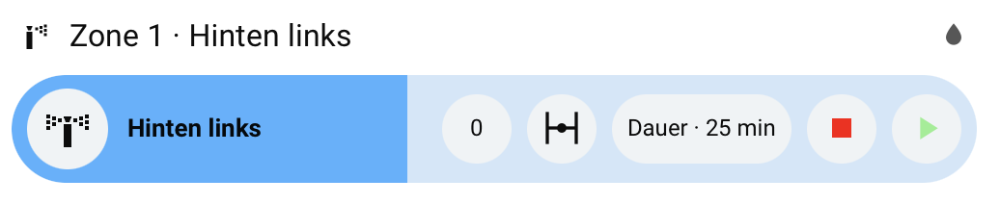

# README

Here you can find some homeassistant snippets that I have created some while ago.
As I have an irrigation system in my garden based on shelly1-s I have designed some ui ideas for that, to control my 4-valves setup accordingly.

Code can be copied above.

## Bubblecard Irrigation

Basically it uses entities of [irrigation_unlimited](https://github.com/rgc99/irrigation_unlimited). Furthermore it calls service coming with this implementation like the percent-complete and so forth.
An additional element is an input number containing the timer duration for manual runs.

Cheers,
hG
